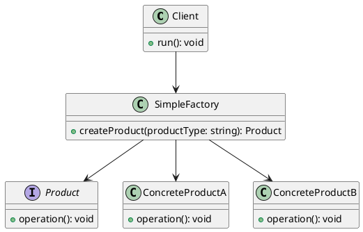

# zh-plantuml-image
plantuml编码为图片url，支持markdown中plantuml渲染为图片进行展示

详细说明：https://wscoder.com/article/29

比如以下代码

编码后：

https://www.plantuml.com/plantuml/svg/~1U9oLaK4AmZ0GHVTpYYmhqWjq8RM2Qq4l4D9H0caI9fD24UzkYcaXkb1dCul__eDXsi2IE0u6G1aPWZWOZPR57KIQBKLRRHenEjt30q1RHhfAXU94hezgvPn7agnTGMUXiugGCJVs_rUw7ofdFNY3HwdOqRJmII9NI-LV-p9vR4HWqlQMD3cTJVdqkjwLEYZbSxwqFfFtSxyZ7K2Bjay_U09XdOKv
